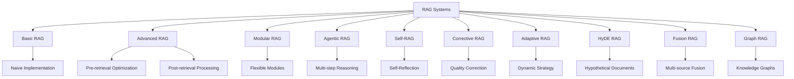
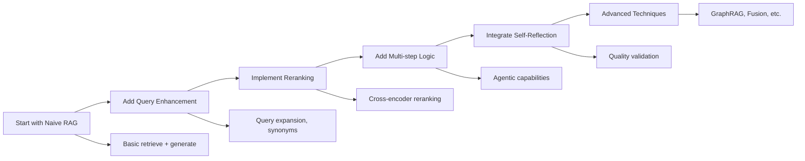

# 🚀 Comprehensive Guide to RAG (Retrieval-Augmented Generation) Systems

[](https://github.com/yourusername/rag-guide)
[](https://python.org)
[](LICENSE)

> **A complete guide to understanding, implementing, and deploying different types of RAG systems for production applications.**

## 📖 Table of Contents

- [Introduction](#introduction)
- [RAG Types Overview](#rag-types-overview)
- [Detailed RAG Architectures](#detailed-rag-architectures)
- [Implementation Examples](#implementation-examples)
- [Comparison Matrix](#comparison-matrix)
- [Use Cases & Applications](#use-cases--applications)
- [Getting Started](#getting-started)
- [Best Practices](#best-practices)
- [Performance Optimization](#performance-optimization)
- [Tools & Frameworks](#tools--frameworks)
- [Resources](#resources)
- [Contributing](#contributing)

## 🎯 Introduction

**Retrieval-Augmented Generation (RAG)** is a powerful AI architecture that combines information retrieval with text generation to create more accurate, contextual, and up-to-date responses. RAG systems retrieve relevant information from external knowledge sources and use this context to generate better answers.

### Why RAG?

- **🎯 Accuracy**: Reduces hallucinations by grounding responses in factual data
- **📚 Knowledge**: Access to vast external knowledge bases
- **🔄 Freshness**: Incorporates up-to-date information
- **💰 Cost-Effective**: More efficient than training massive models
- **🔧 Customizable**: Easily adaptable to domain-specific needs

## 🏗️ RAG Types Overview



## 📋 Detailed RAG Architectures

### 1. 🟢 Naive/Basic RAG

**Architecture**: Simple retrieve-then-generate pipeline

```python
# Basic RAG Flow
query = "What is machine learning?"
relevant_docs = retrieve(query, top_k=5)
context = concatenate(relevant_docs)
response = generate(query, context)
```

**Characteristics**:
- ✅ Simple to implement
- ✅ Low latency
- ❌ Limited contextual understanding
- ❌ No iterative refinement

**Use Cases**: FAQ systems, simple Q&A, documentation lookup

---

### 2. 🟡 Advanced RAG

**Architecture**: Enhanced pipeline with optimization stages

```python
# Advanced RAG Flow
expanded_query = query_expansion(query)
hybrid_results = hybrid_search(expanded_query)  # Semantic + Keyword
reranked_docs = rerank(hybrid_results)
filtered_docs = filter_relevance(reranked_docs)
response = generate(query, filtered_docs)
```

**Enhancements**:
- 🔍 **Pre-retrieval**: Query expansion, decomposition
- 🎯 **Retrieval**: Hybrid search, multiple strategies
- 📊 **Post-retrieval**: Reranking, filtering, summarization

**Use Cases**: Enterprise search, research assistance, complex Q&A

---

### 3. 🟠 Modular RAG

**Architecture**: Flexible, component-based system

```python
class ModularRAG:
    def __init__(self):
        self.query_module = QueryProcessor()
        self.retrieval_module = MultiSourceRetriever()
        self.generation_module = ContextualGenerator()
        self.memory_module = ConversationMemory()
    
    def process(self, query, context=None):
        processed_query = self.query_module.process(query)
        docs = self.retrieval_module.retrieve(processed_query)
        response = self.generation_module.generate(query, docs, context)
        self.memory_module.update(query, response)
        return response
```

**Modules**:
- 🧠 **Query Module**: Understanding, routing, expansion
- 🔍 **Retrieval Module**: Multi-source, adaptive search
- 🤖 **Generation Module**: Context-aware generation
- 💾 **Memory Module**: Conversation history, preferences

**Use Cases**: Conversational AI, multi-domain assistants, personalized systems

---

### 4. 🔴 Agentic RAG

**Architecture**: Autonomous agent with iterative reasoning

```python
class AgenticRAG:
    def __init__(self):
        self.tools = [WebSearch(), Calculator(), DatabaseQuery()]
        self.planner = ActionPlanner()
        self.executor = ToolExecutor()
        self.reflector = SelfReflector()
    
    def solve(self, query):
        plan = self.planner.create_plan(query)
        for step in plan:
            result = self.executor.execute(step, self.tools)
            if not self.reflector.validate(result):
                plan = self.planner.revise_plan(plan, result)
        return self.synthesize_results(plan.results)
```

**Capabilities**:
- 🎯 **Multi-step reasoning**: Complex problem decomposition
- 🛠️ **Tool usage**: APIs, calculators, databases
- 🔄 **Iterative refinement**: Self-correction and improvement
- 🤔 **Reflection**: Quality assessment and validation

**Use Cases**: Research agents, data analysis, complex problem-solving

---

### 5. 🟣 Self-RAG

**Architecture**: Self-reflective system with control tokens

```python
class SelfRAG:
    def generate_with_reflection(self, query):
        # Decide whether to retrieve
        if self.should_retrieve(query):
            docs = self.retrieve(query)
            
            # Assess relevance
            relevant_docs = []
            for doc in docs:
                if self.is_relevant(query, doc):
                    relevant_docs.append(doc)
            
            response = self.generate(query, relevant_docs)
            
            # Self-critique
            if self.is_supported(response, relevant_docs):
                return response
            else:
                return self.refine_response(query, relevant_docs)
        else:
            return self.generate_without_retrieval(query)
```

**Control Tokens**:
- `[Retrieve]`: Decision to retrieve information
- `[ISREL]`: Relevance assessment of retrieved docs
- `[ISSUP]`: Support evaluation of generated response
- `[ISUSE]`: Utility judgment of final answer

**Use Cases**: High-accuracy Q&A, factual verification, critical applications

---

### 6. 🟠 Corrective RAG (CRAG)

**Architecture**: Error detection and correction mechanism

```python
class CorrectiveRAG:
    def process_with_correction(self, query):
        docs = self.retrieve(query)
        confidence = self.evaluate_retrieval_quality(docs)
        
        if confidence < LOW_THRESHOLD:
            # Trigger web search or external sources
            external_docs = self.web_search(query)
            docs.extend(external_docs)
        elif confidence < MEDIUM_THRESHOLD:
            # Decompose and re-retrieve
            sub_queries = self.decompose_query(query)
            for sub_query in sub_queries:
                sub_docs = self.retrieve(sub_query)
                docs.extend(sub_docs)
        
        # Generate with corrected knowledge
        return self.generate(query, docs)
```

**Correction Strategies**:
- 🌐 **Web Search**: Real-time information gathering
- 🔀 **Query Decomposition**: Breaking complex queries
- 📊 **Knowledge Refinement**: Improving document quality
- 🎯 **Confidence Scoring**: Quality assessment

**Use Cases**: News analysis, fact-checking, dynamic information needs

---

### 7. 🔵 Adaptive RAG

**Architecture**: Dynamic strategy selection based on query type

```python
class AdaptiveRAG:
    def __init__(self):
        self.query_classifier = QueryClassifier()
        self.strategies = {
            'simple': SimpleGeneration(),
            'factual': SingleStepRAG(),
            'complex': MultiStepRAG(),
            'conversational': DialogueRAG()
        }
    
    def process(self, query):
        query_type = self.query_classifier.classify(query)
        strategy = self.strategies[query_type]
        return strategy.process(query)
```

**Strategy Selection**:
- 🎯 **No Retrieval**: Simple factual questions
- 🔍 **Single-step RAG**: Straightforward information needs
- 🔄 **Multi-step RAG**: Complex analytical queries
- 💬 **Dialogue RAG**: Conversational contexts

**Use Cases**: Multi-purpose assistants, educational tools, general Q&A

---

### 8. 🟡 HyDE (Hypothetical Document Embeddings)

**Architecture**: Hypothetical document generation for improved retrieval

```python
class HyDERAG:
    def retrieve_with_hyde(self, query):
        # Generate hypothetical document
        hypothetical_doc = self.generate_hypothetical_answer(query)
        
        # Embed hypothetical content
        hyp_embedding = self.embed(hypothetical_doc)
        
        # Retrieve similar real documents
        similar_docs = self.vector_search(hyp_embedding)
        
        # Generate final answer using real documents
        return self.generate(query, similar_docs)
    
    def generate_hypothetical_answer(self, query):
        prompt = f"Write a detailed answer to: {query}"
        return self.llm.generate(prompt)
```

**Process Flow**:
1. 📝 **Generate**: Create hypothetical answer
2. 🔍 **Embed**: Convert to vector representation
3. 🎯 **Retrieve**: Find similar real documents
4. 💡 **Generate**: Create final answer from real sources

**Use Cases**: Scientific research, technical documentation, expert knowledge domains

---

### 9. 🟢 Fusion RAG

**Architecture**: Multiple retrieval strategies with result fusion

```python
class FusionRAG:
    def __init__(self):
        self.retrievers = [
            SemanticRetriever(),
            KeywordRetriever(),
            HybridRetriever()
        ]
        self.fusion_method = ReciprocalRankFusion()
    
    def retrieve_and_fuse(self, query):
        all_results = []
        
        # Multiple query variations
        query_variations = self.generate_query_variations(query)
        
        for variation in query_variations:
            for retriever in self.retrievers:
                results = retriever.retrieve(variation)
                all_results.append(results)
        
        # Fuse results using reciprocal rank fusion
        fused_results = self.fusion_method.fuse(all_results)
        return fused_results
```

**Fusion Types**:
- 📊 **RAG-Fusion**: Multiple queries + reciprocal rank fusion
- 🎭 **Multi-modal**: Text + images + structured data
- 🌐 **Multi-source**: Different databases and APIs

**Use Cases**: Comprehensive research, market analysis, multi-domain search

---

### 10. 🔺 GraphRAG

**Architecture**: Knowledge graph-enhanced retrieval

```python
class GraphRAG:
    def __init__(self):
        self.knowledge_graph = KnowledgeGraph()
        self.entity_extractor = EntityExtractor()
        self.graph_traverser = GraphTraverser()
    
    def retrieve_with_graph(self, query):
        # Extract entities from query
        entities = self.entity_extractor.extract(query)
        
        # Find related entities in graph
        related_entities = []
        for entity in entities:
            neighbors = self.graph_traverser.get_neighbors(entity)
            related_entities.extend(neighbors)
        
        # Retrieve documents about related entities
        docs = []
        for entity in related_entities:
            entity_docs = self.retrieve_by_entity(entity)
            docs.extend(entity_docs)
        
        return self.generate(query, docs)
```

**Graph Components**:
- 🏷️ **Entity Linking**: Connect text to graph nodes
- 🔗 **Relationship Traversal**: Follow graph connections
- 🎯 **Community Detection**: Find topic clusters
- 📊 **Graph Embeddings**: Vector representations of graph structure

**Use Cases**: Biomedical research, financial analysis, knowledge discovery

---

## 📊 Comparison Matrix

| RAG Type | Complexity | Accuracy | Latency | Use Case | Best For |
|----------|------------|----------|---------|----------|----------|
| **Naive RAG** | 🟢 Low | 🟡 Medium | 🟢 Fast | Simple Q&A | Quick prototypes |
| **Advanced RAG** | 🟡 Medium | 🟢 High | 🟡 Medium | Enterprise search | Production systems |
| **Modular RAG** | 🟠 High | 🟢 High | 🟡 Medium | Multi-domain | Scalable solutions |
| **Agentic RAG** | 🔴 Very High | 🟢 Very High | 🔴 Slow | Complex reasoning | Research & analysis |
| **Self-RAG** | 🟠 High | 🟢 Very High | 🟠 Medium-Slow | Critical applications | High-stakes decisions |
| **CRAG** | 🟠 High | 🟢 High | 🟠 Medium-Slow | Dynamic info | News & updates |
| **Adaptive RAG** | 🟡 Medium | 🟢 High | 🟡 Variable | Multi-purpose | General assistants |
| **HyDE** | 🟡 Medium | 🟢 High | 🟡 Medium | Expert domains | Scientific research |
| **Fusion RAG** | 🟠 High | 🟢 Very High | 🔴 Slow | Comprehensive | Market research |
| **GraphRAG** | 🔴 Very High | 🟢 Very High | 🟠 Medium-Slow | Knowledge discovery | Biomedical/Finance |

## 🎯 Use Cases & Applications

### 📚 Educational Technology
- **Personalized Tutoring**: Adaptive RAG for individual learning paths
- **Research Assistance**: Agentic RAG for academic paper analysis
- **Knowledge Assessment**: Self-RAG for accurate evaluation

### 🏥 Healthcare & Life Sciences
- **Medical Q&A**: GraphRAG with medical knowledge graphs
- **Drug Discovery**: Fusion RAG across multiple databases
- **Clinical Decision Support**: Corrective RAG with real-time updates

### 💼 Enterprise & Business
- **Customer Support**: Modular RAG with multi-channel integration
- **Market Research**: Fusion RAG across news, reports, and data
- **Legal Analysis**: Self-RAG for high-accuracy document review

### 🔬 Research & Development
- **Literature Review**: HyDE RAG for scientific paper discovery
- **Data Analysis**: Agentic RAG with analytical tools
- **Innovation Discovery**: GraphRAG for patent and technology mapping

### 🌐 Content & Media
- **News Aggregation**: Corrective RAG with real-time updates
- **Content Creation**: Advanced RAG with style and tone adaptation
- **Fact-Checking**: Self-RAG with verification mechanisms

## 🚀 Getting Started

### Quick Start with Basic RAG

```bash
# Install dependencies
pip install sentence-transformers faiss-cpu openai python-dotenv

# Clone starter template
git clone https://github.com/yourusername/basic-rag-template
cd basic-rag-template

# Set up environment
echo "OPENAI_API_KEY=your-key-here" > .env

# Run example
python basic_rag_example.py
```

### Implementation Steps

1. **📊 Data Preparation**
   ```python
   # Prepare your documents
   documents = [
       {"id": "doc1", "title": "...", "content": "..."},
       {"id": "doc2", "title": "...", "content": "..."}
   ]
   ```

2. **🔍 Choose Embedding Model**
   ```python
   from sentence_transformers import SentenceTransformer
   model = SentenceTransformer('all-MiniLM-L6-v2')
   ```

3. **🗃️ Set Up Vector Store**
   ```python
   import faiss
   import numpy as np
   
   embeddings = model.encode([doc['content'] for doc in documents])
   index = faiss.IndexFlatIP(embeddings.shape[1])
   index.add(embeddings.astype('float32'))
   ```

4. **🤖 Integrate LLM**
   ```python
   import openai
   
   def generate_answer(query, context):
       response = openai.ChatCompletion.create(
           model="gpt-3.5-turbo",
           messages=[
               {"role": "system", "content": "Answer based on context."},
               {"role": "user", "content": f"Context: {context}\n\nQuestion: {query}"}
           ]
       )
       return response.choices[0].message.content
   ```

### Progressive Implementation Path



## 🎛️ Best Practices

### 🏗️ Architecture Design

**Start Simple, Scale Gradually**
```python
# Phase 1: Basic RAG
class BasicRAG:
    def __init__(self):
        self.retriever = SimpleRetriever()
        self.generator = SimpleGenerator()

# Phase 2: Enhanced RAG
class EnhancedRAG(BasicRAG):
    def __init__(self):
        super().__init__()
        self.query_enhancer = QueryEnhancer()
        self.reranker = CrossEncoderReranker()

# Phase 3: Production RAG
class ProductionRAG(EnhancedRAG):
    def __init__(self):
        super().__init__()
        self.cache = RedisCache()
        self.monitor = PerformanceMonitor()
        self.safety = SafetyFilter()
```

### 📊 Data Management

**Document Preprocessing**
```python
def preprocess_documents(documents):
    processed = []
    for doc in documents:
        # Clean text
        clean_text = clean_html_and_formatting(doc['content'])
        
        # Chunk long documents
        chunks = smart_chunking(clean_text, max_length=512, overlap=50)
        
        # Add metadata
        for i, chunk in enumerate(chunks):
            processed.append({
                'id': f"{doc['id']}_chunk_{i}",
                'content': chunk,
                'source': doc['title'],
                'chunk_index': i,
                'metadata': doc.get('metadata', {})
            })
    
    return processed
```

**Embedding Strategy**
```python
# Use appropriate models for your domain
EMBEDDING_MODELS = {
    'general': 'all-MiniLM-L6-v2',
    'scientific': 'allenai/scibert_scivocab_uncased',
    'legal': 'nlpaueb/legal-bert-base-uncased',
    'multilingual': 'sentence-transformers/paraphrase-multilingual-MiniLM-L12-v2'
}
```

### 🔍 Retrieval Optimization

**Hybrid Search Implementation**
```python
class HybridRetriever:
    def __init__(self, alpha=0.7):
        self.semantic_retriever = SemanticRetriever()
        self.keyword_retriever = KeywordRetriever()
        self.alpha = alpha  # Weight for semantic vs keyword
    
    def retrieve(self, query, top_k=10):
        semantic_results = self.semantic_retriever.retrieve(query, top_k)
        keyword_results = self.keyword_retriever.retrieve(query, top_k)
        
        # Combine scores
        combined_results = self.combine_scores(
            semantic_results, keyword_results, self.alpha
        )
        
        return combined_results[:top_k]
```

**Query Enhancement**
```python
def enhance_query(query):
    # Expand with synonyms
    expanded = add_synonyms(query)
    
    # Add domain-specific terms
    enhanced = add_domain_terms(expanded)
    
    # Generate related questions
    related_queries = generate_related_queries(query)
    
    return {
        'original': query,
        'expanded': expanded,
        'enhanced': enhanced,
        'related': related_queries
    }
```

### 🤖 Generation Optimization

**Context Management**
```python
def prepare_context(retrieved_docs, max_tokens=4000):
    # Sort by relevance
    sorted_docs = sorted(retrieved_docs, key=lambda x: x['score'], reverse=True)
    
    context_parts = []
    token_count = 0
    
    for doc in sorted_docs:
        doc_tokens = count_tokens(doc['content'])
        if token_count + doc_tokens <= max_tokens:
            context_parts.append(f"Source: {doc['source']}\n{doc['content']}")
            token_count += doc_tokens
        else:
            break
    
    return '\n\n'.join(context_parts)
```

**Prompt Engineering**
```python
def create_rag_prompt(query, context, system_message=None):
    system_msg = system_message or """
    You are a helpful assistant that answers questions based on the provided context.
    Use only the information in the context to answer questions.
    If the context doesn't contain enough information, say so clearly.
    Cite your sources when possible.
    """
    
    prompt = f"""
    Context:
    {context}
    
    Question: {query}
    
    Instructions:
    - Provide a comprehensive answer based on the context
    - Include relevant details and examples
    - If uncertain, acknowledge limitations
    - Cite sources when making specific claims
    
    Answer:
    """
    
    return system_msg, prompt
```

### 📈 Performance Monitoring

**Evaluation Framework**
```python
class RAGEvaluator:
    def __init__(self):
        self.metrics = {
            'retrieval': ['precision@k', 'recall@k', 'mrr'],
            'generation': ['bleu', 'rouge', 'bert_score'],
            'end_to_end': ['human_rating', 'factual_accuracy']
        }
    
    def evaluate_retrieval(self, queries, ground_truth):
        results = {}
        for query, expected_docs in zip(queries, ground_truth):
            retrieved = self.rag_system.retrieve(query)
            results[query] = {
                'precision@5': self.precision_at_k(retrieved, expected_docs, 5),
                'recall@5': self.recall_at_k(retrieved, expected_docs, 5),
                'mrr': self.mean_reciprocal_rank(retrieved, expected_docs)
            }
        return results
```

## ⚡ Performance Optimization

### 🚀 Speed Optimizations

**Caching Strategy**
```python
import redis
from functools import wraps

class RAGCache:
    def __init__(self):
        self.redis_client = redis.Redis(host='localhost', port=6379, db=0)
        self.ttl = 3600  # 1 hour
    
    def cache_embeddings(self, text_hash, embedding):
        self.redis_client.setex(f"emb:{text_hash}", self.ttl, embedding.tobytes())
    
    def get_cached_embedding(self, text_hash):
        cached = self.redis_client.get(f"emb:{text_hash}")
        return np.frombuffer(cached) if cached else None

def cached_retrieval(func):
    @wraps(func)
    def wrapper(self, query, *args, **kwargs):
        cache_key = f"retrieval:{hash(query)}"
        cached_result = self.cache.get(cache_key)
        
        if cached_result:
            return cached_result
        
        result = func(self, query, *args, **kwargs)
        self.cache.set(cache_key, result, ttl=300)  # 5 minutes
        return result
    
    return wrapper
```

**Async Processing**
```python
import asyncio
import aiohttp
from concurrent.futures import ThreadPoolExecutor

class AsyncRAG:
    def __init__(self):
        self.executor = ThreadPoolExecutor(max_workers=4)
    
    async def parallel_retrieve(self, query):
        # Run multiple retrievers in parallel
        tasks = [
            self.run_retriever(self.semantic_retriever, query),
            self.run_retriever(self.keyword_retriever, query),
            self.run_retriever(self.hybrid_retriever, query)
        ]
        
        results = await asyncio.gather(*tasks)
        return self.merge_results(results)
    
    async def run_retriever(self, retriever, query):
        loop = asyncio.get_event_loop()
        return await loop.run_in_executor(self.executor, retriever.retrieve, query)
```

### 💾 Memory Optimization

**Efficient Vector Storage**
```python
import faiss
import numpy as np

class OptimizedVectorStore:
    def __init__(self, dimension, use_gpu=False):
        self.dimension = dimension
        
        # Use product quantization for memory efficiency
        self.index = faiss.IndexIVFPQ(
            faiss.IndexFlatL2(dimension),
            dimension,
            n_centroids=100,  # Number of clusters
            m=8,  # Number of subquantizers
            nbits=8  # Bits per subquantizer
        )
        
        if use_gpu and faiss.get_num_gpus() > 0:
            self.index = faiss.index_cpu_to_gpu(
                faiss.StandardGpuResources(), 0, self.index
            )
    
    def add_vectors(self, vectors):
        # Train the index first
        if not self.index.is_trained:
            self.index.train(vectors.astype('float32'))
        
        self.index.add(vectors.astype('float32'))
    
    def search(self, query_vector, k=10):
        distances, indices = self.index.search(
            query_vector.astype('float32').reshape(1, -1), k
        )
        return distances[0], indices[0]
```

### 🔧 Infrastructure Scaling

**Microservices Architecture**
```python
# retrieval_service.py
from flask import Flask, request, jsonify

app = Flask(__name__)
retriever = VectorRetriever()

@app.route('/retrieve', methods=['POST'])
def retrieve():
    data = request.json
    query = data['query']
    top_k = data.get('top_k', 10)
    
    results = retriever.retrieve(query, top_k)
    return jsonify(results)

# generation_service.py
from flask import Flask, request, jsonify

app = Flask(__name__)
generator = LLMGenerator()

@app.route('/generate', methods=['POST'])
def generate():
    data = request.json
    query = data['query']
    context = data['context']
    
    response = generator.generate(query, context)
    return jsonify({'response': response})
```

**Docker Deployment**
```dockerfile
# Dockerfile for RAG service
FROM python:3.9-slim

WORKDIR /app

COPY requirements.txt .
RUN pip install -r requirements.txt

COPY . .

EXPOSE 8000

CMD ["uvicorn", "main:app", "--host", "0.0.0.0", "--port", "8000"]
```

## 🛠️ Tools & Frameworks

### 🔧 Development Frameworks

| Framework | Language | Strengths | Best For |
|-----------|----------|-----------|----------|
| **LangChain** | Python | Rich ecosystem, many integrations | Rapid prototyping |
| **LlamaIndex** | Python | Document-focused, easy indexing | Document Q&A |
| **Haystack** | Python | Production-ready, modular | Enterprise deployment |
| **Semantic Kernel** | C#/Python | Microsoft ecosystem integration | .NET applications |
| **AutoGPT** | Python | Autonomous agents | Complex workflows |

### 📊 Vector Databases

| Database | Type | Strengths | Use Case |
|----------|------|-----------|----------|
| **Pinecone** | Managed | Fully managed, scalable | Production systems |
| **Weaviate** | Open Source | GraphQL API, modules | Flexible deployments |
| **Chroma** | Embedded | Lightweight, easy setup | Development/prototyping |
| **Qdrant** | Open Source | High performance, Rust-based | High-throughput systems |
| **FAISS** | Library | Meta's library, highly optimized | Research/custom solutions |

### 🤖 LLM Providers

| Provider | Models | Strengths | Pricing |
|----------|--------|-----------|---------|
| **OpenAI** | GPT-4, GPT-3.5 | High quality, reliable | Token-based |
| **Anthropic** | Claude | Safety-focused, long context | Token-based |
| **Google** | Gemini, PaLM | Multimodal, competitive | Token-based |
| **Hugging Face** | Open models | Open source, customizable | Inference endpoints |
| **Local Models** | Llama, Mistral | Privacy, control | Hardware costs |

### 📈 Monitoring & Observability

```python
# Integration with monitoring tools
import wandb
from prometheus_client import Counter, Histogram, start_http_server

class RAGMonitor:
    def __init__(self):
        # Prometheus metrics
        self.query_counter = Counter('rag_queries_total', 'Total RAG queries')
        self.latency_histogram = Histogram('rag_latency_seconds', 'RAG latency')
        self.error_counter = Counter('rag_errors_total', 'RAG errors')
        
        # Weights & Biases logging
        wandb.init(project="rag-system")
    
    def log_query(self, query, response, latency, sources):
        self.query_counter.inc()
        self.latency_histogram.observe(latency)
        
        wandb.log({
            'query_length': len(query),
            'response_length': len(response),
            'latency': latency,
            'num_sources': len(sources)
        })
```

## 📚 Resources

### 📖 Essential Papers

1. **RAG Foundations**
   - [Retrieval-Augmented Generation for Knowledge-Intensive NLP Tasks](https://arxiv.org/abs/2005.11401)
   - [Dense Passage Retrieval for Open-Domain Question Answering](https://arxiv.org/abs/2004.04906)

2. **Advanced RAG Techniques**
   - [Self-RAG: Learning to Critique and Revise](https://arxiv.org/abs/2310.11511)
   - [Corrective Retrieval Augmented Generation](https://arxiv.org/abs/2401.15884)
   - [HyDE: Precise Zero-Shot Dense Retrieval](https://arxiv.org/abs/2212.10496)

3. **Graph-Enhanced RAG**
   - [From Local to Global: A Graph RAG Approach](https://arxiv.org/abs/2404.16130)
   - [Knowledge Graph Enhanced RAG](https://arxiv.org/abs/2311.04813)

### 🎓 Learning Resources

**Online Courses**
- [DeepLearning.AI RAG Course](https://www.deeplearning.ai/courses/retrieval-augmented-generation/)
- [LangChain & Vector Databases Course](https://www.pinecone.io/learn/)
- [Hugging Face NLP Course](https://huggingface.co/course/)

**Books**
- "Building LLM Applications" by Valentina Alto
- "Hands-On Large Language Models" by Jay Alammar
- "Vector Databases" by Denis Rothman

**Blogs & Tutorials**
- [Pinecone Learning Center](https://www.pinecone.io/learn/)
- [LangChain Blog](https://blog.langchain.dev/)
- [Towards Data Science RAG Articles](https://towardsdatascience.com/tagged/rag)

### 🛠️ Implementation Templates

**GitHub Repositories**
- [Basic RAG Template](https://github.com/microsoft/rag-template)
- [Production RAG Pipeline](https://github.com/pinecone-io/examples)
- [RAG Evaluation Suite](https://github.com/explodinggradients/ragas)

**Docker Compose Examples**
```yaml
# docker-compose.yml for RAG stack
version: '3.8'
services:
  rag-api:
    build: .
    ports:
      - "8000:8000"
    environment:
      - OPENAI_API_KEY=${OPENAI_API_KEY}
    depends_on:
      - vector-db
      - redis

  vector-db:
    image: qdrant/qdrant
    ports:
      - "6333:6333"
    volumes:
      - qdrant_storage:/qdrant/storage

  redis:
    image: redis:alpine
    ports:
      - "6379:6379"

volumes:
  qdrant_storage:
```

## 🤝 Contributing

We welcome contributions to improve this guide! Please see our [Contributing Guidelines](CONTRIBUTING.md) for details.

**Ways to Contribute:**
- 📝 Add new RAG implementation examples
- 🐛 Report bugs or suggest improvements
- 📚 Improve documentation and tutorials
- 🧪 Add evaluation benchmarks
- 🔧 Contribute tools and utilities

## 📄 License

This project is licensed under the MIT License - see the [LICENSE](LICENSE) file for details.

## 🙏 Acknowledgments

- Meta AI for the original RAG paper
- OpenAI for GPT models
- Anthropic for Claude and safety research
- The open-source community for frameworks and tools
- Contributors and maintainers of this guide

---

**⭐ Star this repository if you find it helpful!**

**🔗 Connect with us:**
- [Twitter](https://twitter.com/yourusername)
- [LinkedIn](https://linkedin.com/in/yourusername)
- [Medium](https://medium.com/@yourusername)

---

*Last updated: December 2024*
